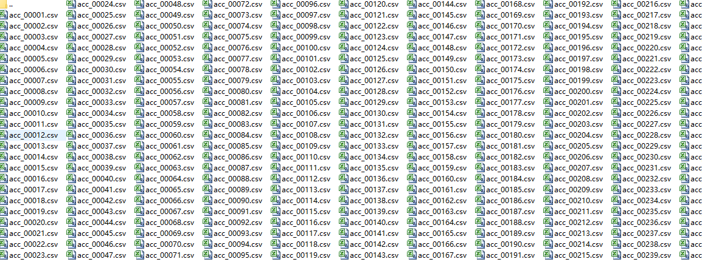
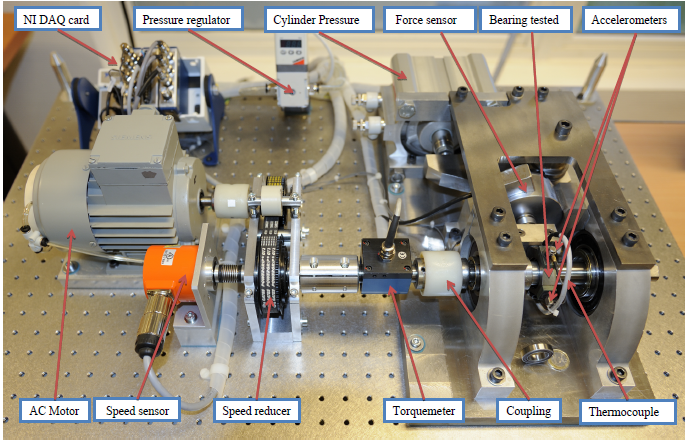

# PhHM 2012 Dataset

The PhHM 2012 dataset is a collection of images and labels used for object detection, recognition, and tracking tasks in the field of hyperspectral imagery. The dataset consists of 54 hyperspectral images captured from different locations across the globe, including urban areas, agricultural fields, and forests. Each image contains multiple bands of spectral data, which are used to capture the reflectance characteristics of the objects present in the scene.

The dataset is divided into three categories: training, validation, and testing. The training set is used to train the models with the labeled data, while the validation set is used to evaluate the performance of the models on unseen data. The testing set is used to test the final models on new data and assess their accuracy and efficiency.

The labels in the dataset are provided in two formats: XML and JSON. The XML format is a simple text file that contains the label information for each image and band. The JSON format is a more structured file that provides detailed information about each label, including its name, description, and coordinates.

To use the PhHM 2012 dataset for object detection, recognition, and tracking tasks, researchers can follow the instructions provided in the accompanying documentation. This includes downloading the dataset, preprocessing it, and selecting the appropriate model architecture and training parameters based on the specific requirements of their research project.

## Images

Here is a pay link on Stripe ( https://buy.stripe.com/3cs8yP7sY87d0vu9AB ). Please contact me lonlonago@foxmail.com after funding $89, and I will send you a complete data files , thank you!

